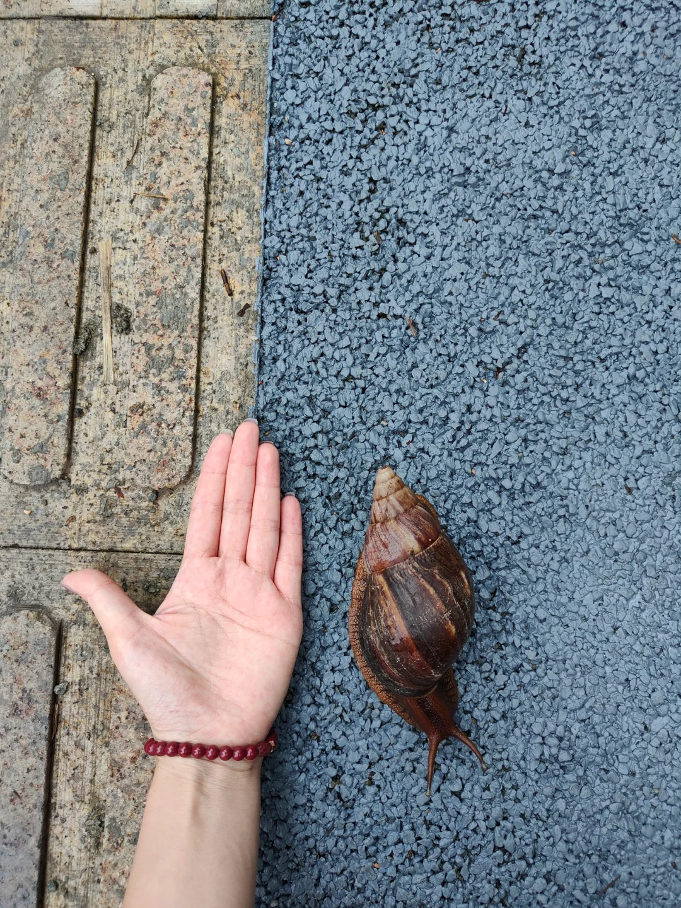

### 1. 引言

最近深圳有一场台风“苏拉”，雨淅淅沥沥的在下，似乎想要弥补前阵子“秋高气爽”宜人的气候。雨中虽然不那么令人振奋，但是空气清新的雨后似乎是简单户外活动的最佳时机，我一般喜欢在雨后的夜里独自骑车，感受泥土的芬芳。当然，不仅我是这么想的，非洲大蜗牛也同样是这么想的，雨后湿润的环境也令它们心大悦，慢慢悠悠地穿过平常干燥的自行车道。我时常会想一个问题，那就是在我不看路的情况下，撞到他们的概率是多少呢？

**问题定义：**

+ 假设有一条笔直的自行车道，其宽度为D
+ 有一只静止不动的非洲大蜗牛的宽度为d
+ 自行车沿着自行车道行驶，其轮胎的宽度为x

如果非洲大蜗牛的位置和自行车的轨迹都是随机的，且不变的，那么自行车撞到非洲大蜗牛的概率是多少？

