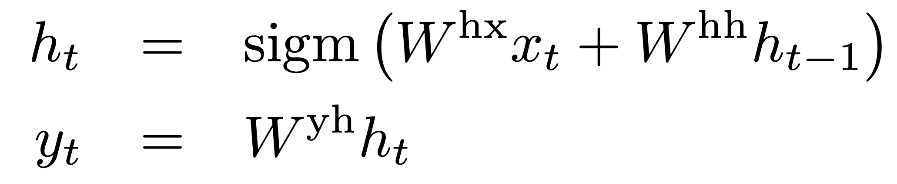
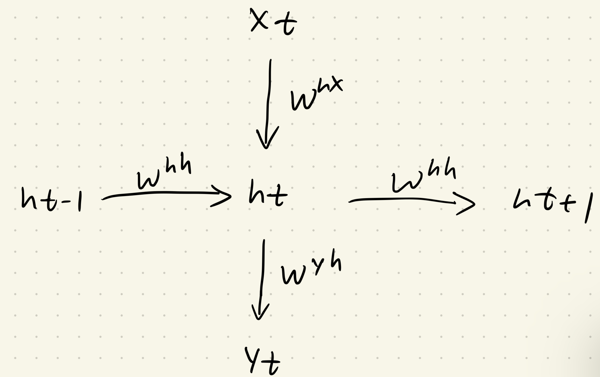

Orginal Paper:  [Sequence to Sequence Learning with Neural Networks](https://arxiv.org/pdf/1409.3215)

在此访问[源代码](https://github.com/zhengyang-2002/Paper_reading-Replicating/blob/main/Code/Seq2seq.ipynb)

### 1. 引言

Seq2seq出现于2014年，当时深度学习的强大正在逐渐被人们所认识，并且随着诸如ReLU，Adam等深度学习技术逐渐出现并成熟，研究人员有意使用蓬勃发展的深度学习技术来挑战传统统计算法在序列任务中的地位。

本文的主要贡献是设计了一种以DNN（Deep Neural Network）为核心，同时能够进行端到端训练的结构。这个结构的主要优势是：

+ 对输入和输出的长度没有严格要求，能够开展通用的，不限长度的端到端序列训练
+ 编码器解码器互相独立，能够适配不同种类序列的任务
+ 编码器和解码器中间使用一个压缩的隐藏状态联系，使得解码器生成的内容可以参考所有的隐藏状态，而不需要和编码器输入的内容一一对应


### 2. Seq2seq的实现

文中关于RNN的定义如图：



根据该定义我们可以很轻易地画出RNN的草图：



而具体实现的时候，因为编码器部分并不需要进行任何输出，所以也不需yh矩阵，实现如下：

```python
class Seq_1(nn.Module):
    def __init__(self):
        super(Seq_1, self).__init__()
        self.xh = nn.Sequential(
            nn.Linear(cfg.embedding_size, cfg.hidden_size*2),
            nn.ReLU(),
            nn.Linear(cfg.hidden_size*2, cfg.hidden_size//2),
            nn.ReLU(),
            nn.Linear(cfg.hidden_size//2, cfg.hidden_size)
        )
        self.hh = nn.Sequential(
            nn.Linear(cfg.hidden_size, cfg.hidden_size*2),
            nn.ReLU(),
            nn.Linear(cfg.hidden_size*2, cfg.hidden_size//2),
            nn.ReLU(),
            nn.Linear(cfg.hidden_size//2, cfg.hidden_size)
        )
        self.sigmoid = nn.Sigmoid()
        self.tanh = nn.Tanh()

    def forward(self, seq, input_lengths):
        batch_size, seq_len, embedding_size = seq.size()
        mask = torch.arange(seq_len, device=cfg.device).expand(batch_size, -1) < input_lengths.unsqueeze(1)

        hidden_state = torch.zeros(batch_size, cfg.hidden_size, device=cfg.device)

        for t in range(seq_len):
            token = seq[:,t,:]
            current_mask = mask[:, t].unsqueeze(1)
            temp_hidden_state = self.tanh(self.xh(token)+self.hh(hidden_state))
            hidden_state = torch.where(current_mask, temp_hidden_state, hidden_state)
            
        return hidden_state
```

考虑到模型训练的时候是以batch来训练的，但是batch中的每一个样本的长度并不是一样的，所以在每一个循环结束之后我们需要判断某样本在这个循环当中是否需要更新，以避免不合理的计算。同时我们将hidden_state初始化为全零矩阵。

以下是解码器的实现：
```python
class Seq_2(nn.Module):
    def __init__(self):
        super(Seq_2, self).__init__()
        self.hh = nn.Sequential(
            nn.Linear(cfg.hidden_size, cfg.hidden_size*2),
            nn.ReLU(),
            nn.Linear(cfg.hidden_size*2, cfg.hidden_size//2),
            nn.ReLU(),
            nn.Linear(cfg.hidden_size//2, cfg.hidden_size),
            nn.ReLU()
        )
        self.hv = nn.Sequential(
            nn.Linear(cfg.hidden_size, cfg.hidden_size*2),
            nn.ReLU(),
            nn.Linear(cfg.hidden_size*2, cfg.hidden_size//2),
            nn.ReLU(),
            nn.Linear(cfg.hidden_size//2, cfg.vocab_size)
        )
        self.sigmoid = nn.Sigmoid()

    def forward(self, hidden_state, decode_length):
        batch_size, _ = hidden_state.size()
        outputs = torch.zeros(batch_size, decode_length, cfg.vocab_size, device=cfg.device) # this tensor have a continual ram space, use it to avoid using torch.cat(), which cause O(n^2) complexity
        
        for t in range(decode_length):
            hidden_state = self.hh(hidden_state)
            outputs[:,t,:] = self.hv(hidden_state)
    
        return outputs
```

解码器的实现比编码器简单很多，并且多了hy矩阵用来将隐藏状态映射为输出。


### 3. 实验设计

正如Seq2seq设计之出所设想的一样，它几乎可以完成任何序列到序列任务的训练。我设计了一个简单直观的任务，并且可以很好利用上Seq2seq的特性。

---

**质数序列提取任务**

 **输入**
- 一个整数序列 $x = [x_1, x_2, \dots, x_n]$，其中：
  - 序列长度 $n \leq \text{max\_length}$。
  - 每个整数 $x_i$ 满足 $1 \leq x_i \leq \text{cfg.vocab\_size} - 2$。

 **输出**
- 一个整数序列 $y = [y_1, y_2, \dots, y_m]$，其中：
  - 输出序列 $y$ 是输入序列中所有质数的序列。

---

 **训练与评估流程**

 **训练**
- 模型进行$\text{evaluate\_round}$轮独立训练，每轮训练进行 $\text{steps}$ 次更新。
- 每次训练后，模型会保存并用于评估。

 **评估**
- 评估模型的性能时，随机生成 $\text{test_samples}$ 个样本计算指标的平均值：
  1. **PSA**（位置序列准确率）
  2. **LCSR**（最长公共子序列比率）
  3. **GeoMean**（PSA 和 LCSR 的几何平均值）

---

 **评估指标定义**

 **1. PSA（Position Sequence Accuracy）**
PSA 衡量预测序列与目标序列在每个位置上的匹配程度。对于第 $i$ 个样本：

$
\text{PSA}^{(i)} = \frac{1}{L_i} \sum_{k=1}^{L_i} \delta\left(y_k^{(i)}, \hat{y}_k^{(i)}\right)
$

其中：
- $L_i$：目标序列 $y^{(i)}$ 的长度。
- $\delta(y_k^{(i)}, \hat{y}_k^{(i)})$：指示函数，当 $y_k^{(i)} = \hat{y}_k^{(i)}$ 时取值 1，否则取值 0。
- $y_k^{(i)}$：目标序列的第 $k$ 个元素。
- $\hat{y}_k^{(i)}$：预测序列的第 $k$ 个元素。

整体 PSA 为所有样本的平均值：

$
\text{PSA} = \frac{1}{N} \sum_{i=1}^{N} \text{PSA}^{(i)}
$

**2. LCSR（Longest Common Subsequence Ratio）**
LCSR 衡量预测序列与目标序列的最长公共子序列（LCS）的比例。对于第 $i$ 个样本：

$
\text{LCSR}^{(i)} = \frac{\text{LCS}(y^{(i)}, \hat{y}^{(i)})}{L_i}
$

其中：
- $\text{LCS}(y^{(i)}, \hat{y}^{(i)})$：目标序列 $y^{(i)}$ 和预测序列 $\hat{y}^{(i)}$ 的最长公共子序列长度。
- $L_i$：目标序列 $y^{(i)}$ 的长度。

整体 LCSR 为所有样本的平均值：

$
\text{LCSR} = \frac{1}{N} \sum_{i=1}^{N} \text{LCSR}^{(i)}
$

3. GeoMean（Geometric Mean）**
GeoMean 是 PSA 和 LCSR 的几何平均值，用于综合评估模型性能：

$
\text{GeoMean} = \sqrt{\text{PSA} \times \text{LCSR}}
$

具体实现请参考源代码


### 4. 任务模型

前面我们已经定义了**Seq2seq基础结构**和**质数提取任务**。但是此时的Seq2seq模型还不能直接用来训练我们所定义的任务，还有以下的问题亟待解决：

+ int要如何作为特征，被放入模型
+ 模型要如何终止解码

---

针对第一个问题，我们当然可以很简单的使用one-hot encoding来最大程度的保留输入元素的细节，但是由于$ \text{max\_length}$可能会很大，这样会导致维度灾难。所以此处我选择的是embedding的方式，它可以将范围很大的int全部映射到固定长度的特征

```python
embedding = nn.Embedding(cfg.vocab_size, cfg.embedding_size, device=cfg.device)
```

---

而关于模型要如何终止解码，我们则可以在构建input和target的时候，将一个自定义的终止符号*<eos>*拼接到target末端，比如：
```
input: [29, 35, 2, 17, 54, 93, padding, padding, ...]
target: [29, 2, 17, 93, <eos>]
```

这样模型就能够学习到解码的什么时候该输出<eos>，而我们则可以在后处理阶段进行<eos>的检测，并终止解码。当然，此处<eos>是需要计算loss的，而padding则不参与任何计算（这一细节在前面Seq1的代码实现中也有提到）。


### 5. 结果评估


Seq2seq的原文中提到了他们将input reverse之后模型性能有所提升的细节。文中使用了机器翻译的例子（~~$a, b, c$ ---> $α, β, γ$~~   --->  $c, b, a$ ---> $α, β, γ$），指出讲input进行reverse可以更好地利用input和target之间的对称性，并且减少了RNN所需要学习复杂性。

在此，我也通过质数提取任务探究这个trick的效果：

| **max_length** | **reverse** | **PSA** | **LCSR** | **GeoMean** |
| -------------- | ----------- | ------- | -------- | ----------- |
| 5              | False       | 0.4837  | 0.4854   | 0.4838      |
| 10             | False       | 0.2312  | 0.2451   | 0.2316      |
| 15             | False       | 0.1084  | 0.1339   | 0.1090      |
| 5              | True        | 0.4778  | 0.4789   | 0.4780      |
| 10             | True        | 0.3389  | 0.3505   | 0.3399      |
| 15             | True        | 0.1507  | 0.1759   | 0.1520      |

