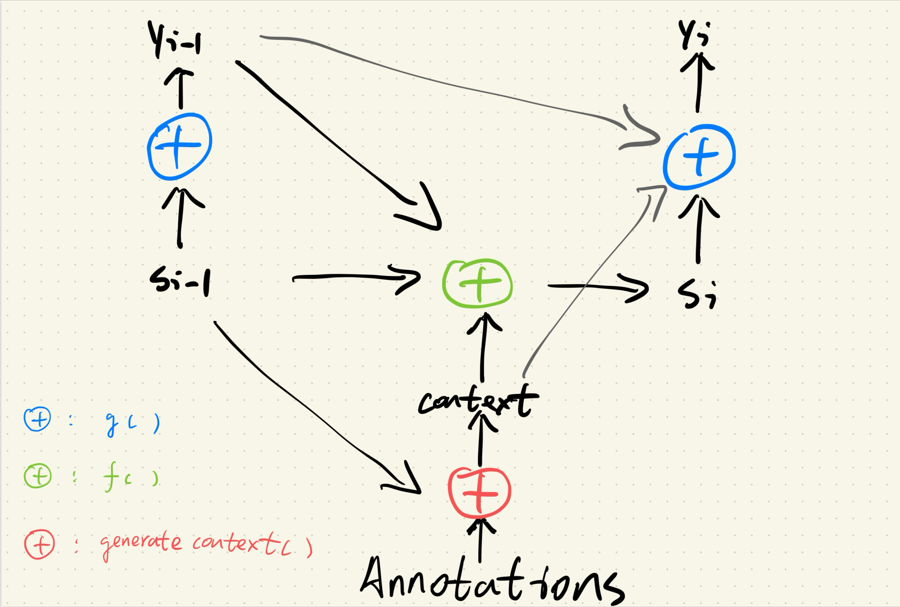
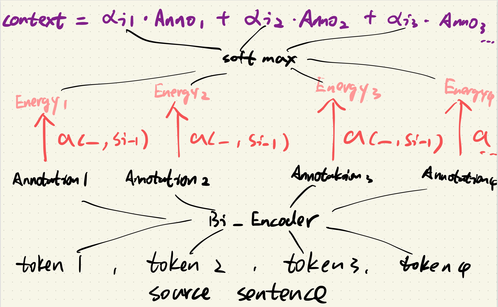
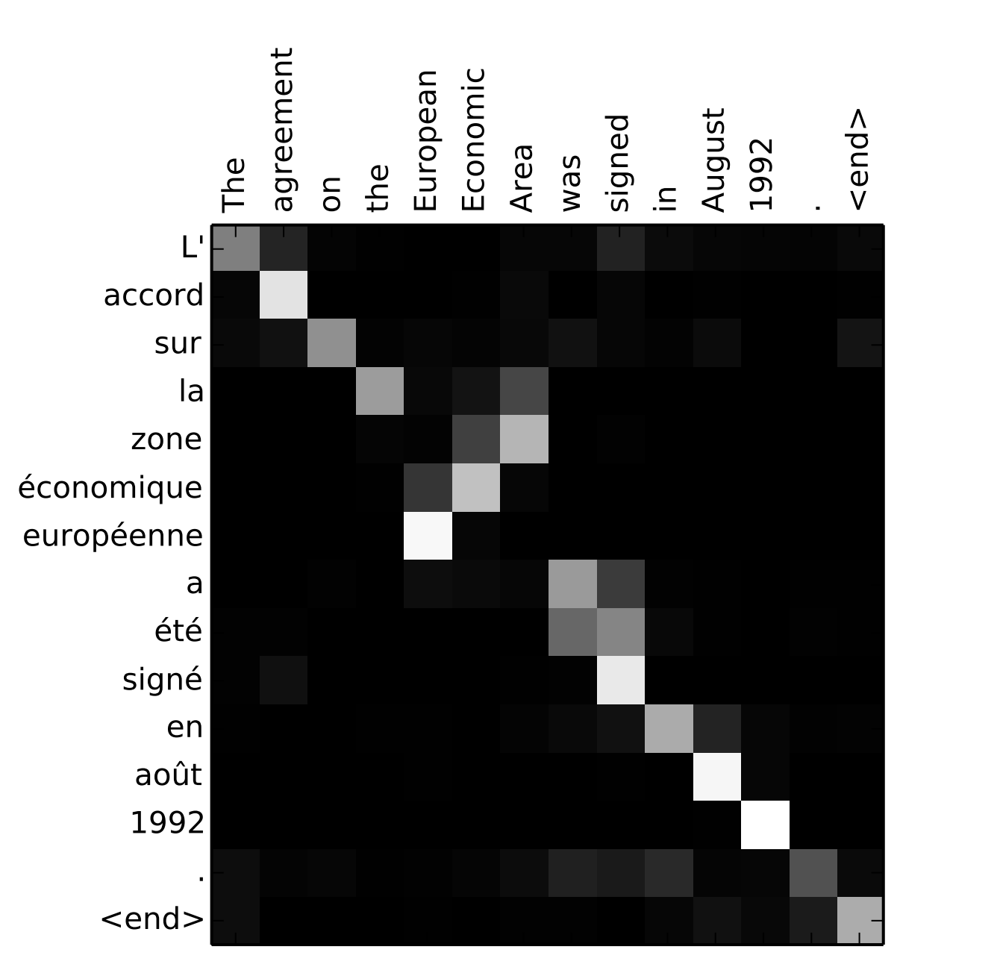
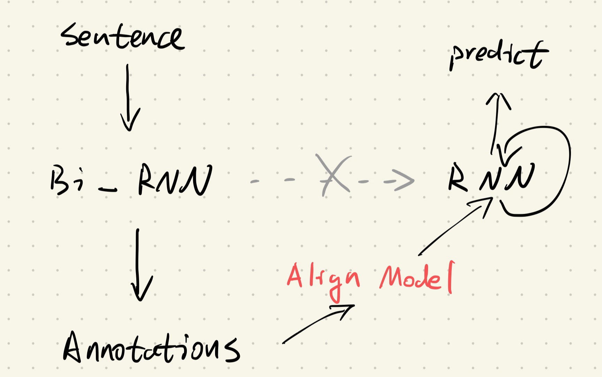
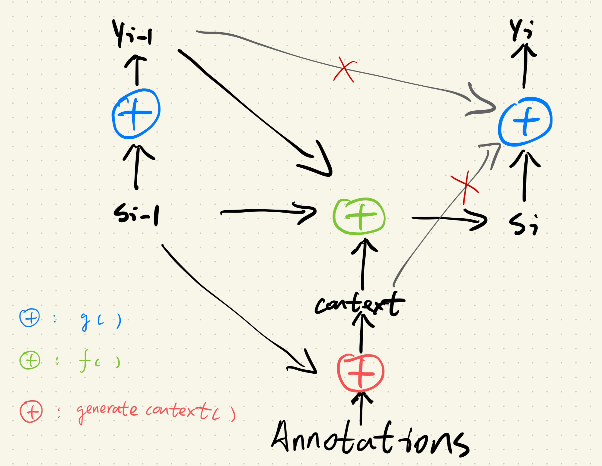
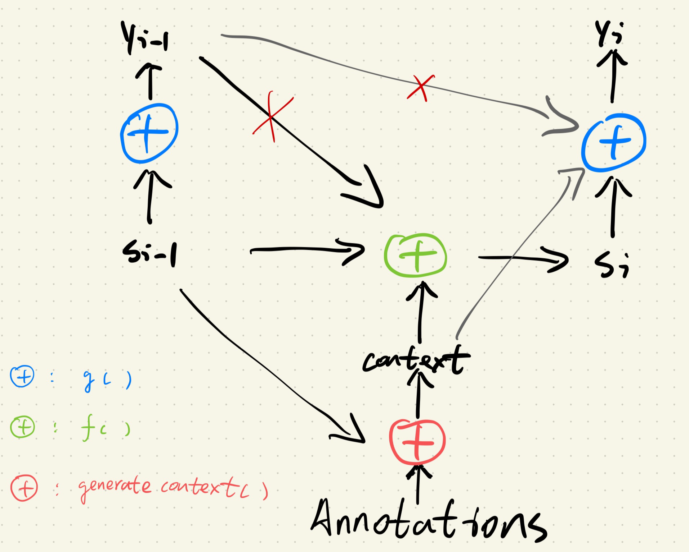
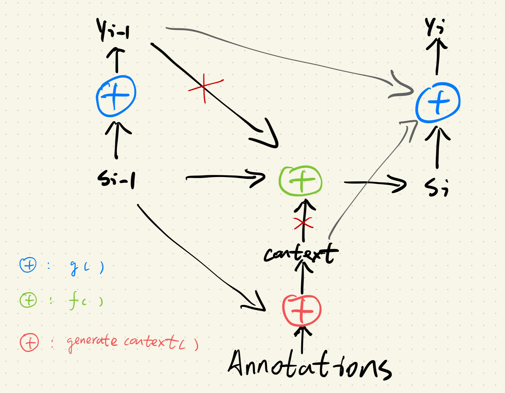

Orginal Paper:  [NEURAL MACHINE TRANSLATION BY JOINTLY LEARNING TO ALIGN AND TRANSLATE](https://arxiv.org/pdf/1409.0473)

在此访问[源代码](https://github.com/zhengyang-2002/Paper_reading-Replicating/blob/main/Code/Seq2seq.ipynb)


### 1. 引言

Seq2seq的出现为NMT(Neural Machine Translation)提供了一个完美的，端到端训练的范本，但是同时也存在了很多不成熟的地方有待改进。本文中就提到了传统Seq2seq模型存在的关键问题：

+ 传统的Seq2seq需要compress所有的输入信息到一个固定长度的向量，这大大限制了它在处理长序列任务时的性能。

基于这个问题，本文提出了一个关于新版Seq2seq模型的设想：

+ 这个新版的Seq2seq不仅可以利用一个固定长度的信息向量来解码，它还能进行软路由，即回顾输入的某个子集
+ “软路由”意味着模型需要根据上下文来自动选取合适的子集，并且这个子集可能是不明确的（模型需要想办法表征输入子集）
+ “回顾输入的某个子集”则意味着模型的信息通路需要进行调整（并非一条线到底的信息流）

基于以上设想，作者为这篇工作取名为Neural Machine Translation（点明任务类型）By Jointly Learning To Align And Translation（方法特点）。同时这篇工作中的方法还有一个响亮的名字，即Bahdanau Attention，也被认为是初代Attention机制。

### 2. 方法

简单来说，Bahdanau Attention在原有的Seq2seq基础之上额外设计了一条信息通路，类似：


即模型在完成传统的Seq2seq模型训练的同时，“jointly”训练“Align”模型。而这个Align模型通过选择性地回顾input，以解决fixed vector表达能力弱的问题。

#### 2.1 双向编码器

原文中采用了双向RNN模型以及他们的隐藏状态来表征所有input，类似：


具体来说，就是用两个相反的RNN网络来给每一个token都建立一个hidden_state，并且通过concatenate的方式将它们结合起来，得到所谓的annotation（这个annotation后续会通过align model来选择性地回放给decoder）。关于为什么要使用双向RNN而非普通的单向RNN，文中的解释是他们希望annotation不仅表征在它之前的word，还要表征在其之后的word。

我个人的理解是，如果使用单向RNN，那么位于序列开头的word总会得到更多的表征，这引入了不恰当的先验。同时双向RNN也更容易学习到全面的语序关系。

本文中Bi_Encoder的实现如下：

```python
class Bi_Encoder(nn.Module):
    def __init__(self):
        super(Bi_Encoder, self).__init__()
        def __create_xh(embedding_size, hidden_size):
            return nn.Sequential(
                nn.Linear(embedding_size, hidden_size//2),
                nn.ReLU(),
                nn.Linear(hidden_size//2, hidden_size)
            )
        def __create_hh(hidden_size):
            return nn.Sequential(
                nn.Linear(hidden_size, hidden_size//2),
                nn.ReLU(),
                nn.Linear(hidden_size//2, hidden_size)
            )
    
        self.xh = __create_xh(cfg.embedding_size, cfg.hidden_size)
        self.hh = __create_hh(cfg.hidden_size)
        self.xh_ = __create_xh(cfg.embedding_size, cfg.hidden_size)
        self.hh_ = __create_hh(cfg.hidden_size)
        
        self.tanh = nn.Tanh()

    def forward(self, seq, input_lengths):
        batch_size, seq_len, embedding_size = seq.size()
        mask = torch.arange(seq_len, device=cfg.device).expand(batch_size, -1) < input_lengths.unsqueeze(1)
        
        hidden_state = torch.zeros(batch_size, cfg.hidden_size, device=cfg.device)
        hidden_state_ = torch.zeros(batch_size, cfg.hidden_size, device=cfg.device)

        forward_hidden_states = torch.zeros(batch_size, seq_len, cfg.hidden_size, device=cfg.device)
        backward_hidden_states = torch.zeros(batch_size, seq_len, cfg.hidden_size, device=cfg.device)

        for t in range(seq_len):
            token, token_ = seq[:,t,:], seq[:,seq_len-t-1,:]
            current_mask, current_mask_ = mask[:, t].unsqueeze(1), mask[:, seq_len-t-1].unsqueeze(1)
            
            temp_hidden_state = self.tanh(self.xh(token)+self.hh(hidden_state))
            temp_hidden_state_ = self.tanh(self.xh_(token_)+self.hh_(hidden_state_))
            
            hidden_state = torch.where(current_mask, temp_hidden_state, hidden_state) # batch_size, embedding_size
            hidden_state_ = torch.where(current_mask_, temp_hidden_state_, hidden_state_)

            forward_hidden_states[:, t, :] = hidden_state
            backward_hidden_states[:, seq_len-t-1, :] = hidden_state_

        annotations = torch.concatenate([forward_hidden_states, backward_hidden_states], dim=-1)
        return hidden_state, annotations
```

实现方法上相较于单向RNN Encoder，只需要重新初始化一份相同的RNN网络，并且把token以逆序进行输入即可。同时逆向RNN并不需要重新定义Mask，直接采用Seq2seq文中提到的Mask的构建方法即可。当然在Bi_Encoder中，我们有两倍的参数需要维护，同时我们还需要额外保存所有的Annotations，这也给模型训练额外添加了成本。

总的来说，Bi_Encoder接收输入token，并且得到每个token的annotation，同时还返回正向RNN的最终hidden_state用以放入Decoder。

#### 2.2 注意力解码器

解码器的主要结构如下，大致包含了三个可训练的模块，在图中由蓝绿红三色来表示。

原文中关于这三个可训练模块的描述是：

$$
 p(y_i \mid y_1, \ldots, y_{i-1}, \mathbf{x}) = g(y_{i-1}, s_i, c_i)
$$


$$
s_i = f(s_{i-1}, y_{i-1}, c_i) 
$$

$$
c_i = \sum_{j=1}^{T_x} \alpha_{ij} h_j
$$


The weight \(\alpha_{ij}\) of each annotation \(h_j\) is computed by


$$
\alpha_{ij} = \frac{\exp(e_{ij})}{\sum_{k=1}^{T_x} \exp(e_{ik})}
$$
where

$$
e_{ij} = a(s_{i-1}, h_j)
$$




网络看起来是比较复杂，但是简而言之，现在的解码器的隐藏状态更新和预测都需要用到Context和Yi-1（上一步的预测）。而文章的重点在于如何生成合适的Context。

文章中的实现是用一个Model a，给每个Annotation计算特定隐藏状态（Si-1）下的Energy，这个Energy是一个标量，后续所有Energy会被Softmax并作为每个Annotation的权重，最后进行加和得到Context，具体计算过程如图。



至此，Model a就会作为整个Seq2seq模型的一部分，共同参与训练。此时梯度下降不仅仅需要RNN网络的编码能力，也同时训练Model a，让Model a能够基于不同的隐藏状态给每个annotation合理分配权重。强相关的annotation会被Model a赋予更多的Energy（因此也意味着更大的权重），这在文中的Figure 3也有所体现。可以看出英法词汇意思相同的部分（即对角线）高亮，证明Model a会准确选择所需的Annotation。但是也注意到非对角线部分也存在高亮的情况，这可能是Model a额外学习到的软对齐。




整体Decoder的思路不难理解，我们只需要一步步定义g(),f(),generate_context()即可，具体代码实现如下：

```python
class Attention_Decoder(nn.Module):
    def __init__(self):
        super(Attention_Decoder, self).__init__()
        # Output Matrix
        self.Wg = nn.Sequential(
            nn.Linear(cfg.embedding_size+cfg.hidden_size+cfg.hidden_size*2, cfg.embedding_size//2),
            nn.ReLU(),
            nn.Linear(cfg.embedding_size//2, cfg.embedding_size)
        )
        # Hidden Matrix
        self.Wf = nn.Sequential(
            nn.Linear(cfg.hidden_size+cfg.embedding_size+cfg.hidden_size*2, cfg.hidden_size//2),
            nn.ReLU(),
            nn.Linear(cfg.hidden_size//2, cfg.hidden_size)
        )
        # Alignment Matrix
        self.Wa = nn.Sequential(
            nn.Linear(cfg.hidden_size+cfg.hidden_size*2, cfg.hidden_size),
            nn.ReLU(),
            nn.Linear(cfg.hidden_size, 1)
        )

        self.fc = nn.Linear(cfg.embedding_size, cfg.vocab_size)
          
    def g(self, y_prev, s_i, c_i):
        temp_state = torch.concatenate([y_prev, s_i, c_i], dim=-1)
        predication = self.Wg(temp_state)
        return predication
        
    def f(self, s_prev, y_prev, c_i):
        temp_state = torch.concatenate([s_prev, y_prev, c_i], dim=-1)
        new_hidden_state = self.Wf(temp_state)
        return new_hidden_state

    def a(self, s_prev, annotation):
        temp_state = torch.concatenate([s_prev, annotation], dim=-1)
        energy = self.Wa(temp_state).squeeze(-1)  # consecutive dim_size = 1 could squeeze into one dim_size = 1
        return energy

    def generate_context(self, s_prev, annotations):
        # At this moment, s_prev: batch_size, hidden_size; annotations: batch_size, annotation_number, annotation_size
        batch_size, annotation_number, annotation_size = annotations.size()
        s_prev = s_prev.unsqueeze(1).expand(batch_size, annotation_number, -1)

        energys = self.a(s_prev, annotations) 
        attention_weight_expand = torch.nn.functional.softmax(energys, dim=1).unsqueeze(-1)
        context = torch.sum(annotations*attention_weight_expand, dim=1) # batch_size, annotation_size
        return context

    def forward(self, hidden_state, decode_length, annotations):
        batch_size, _ = hidden_state.size()
        outputs = torch.zeros(batch_size, decode_length, cfg.embedding_size, device=cfg.device)
        y = torch.zeros(batch_size, cfg.embedding_size, device=cfg.device)
        for t in range(decode_length):
            y_prev = y
            c_i = self.generate_context(hidden_state, annotations)
            hidden_state = self.f(hidden_state, y_prev, c_i)
            y = self.g(y_prev, hidden_state, c_i)
            outputs[:,t,:] = y
        outputs = self.fc(outputs)
        return outputs
```


### 3. 实验

这一部分部分的

切断通路

```
------ Round 1/10 ------
Training: 100%|█████████████████████████████████████████████████████████████████████| 2000/2000 [03:42<00:00,  9.00it/s]
[Round 1] PSA: 0.7750, LCSR: 0.7821, GeoMean: 0.7783
------ Round 2/10 ------
Training: 100%|█████████████████████████████████████████████████████████████████████| 2000/2000 [03:34<00:00,  9.31it/s]
[Round 2] PSA: 0.8074, LCSR: 0.8182, GeoMean: 0.8122
------ Round 3/10 ------
Training: 100%|█████████████████████████████████████████████████████████████████████| 2000/2000 [03:43<00:00,  8.94it/s]
[Round 3] PSA: 0.8259, LCSR: 0.8415, GeoMean: 0.8315
------ Round 4/10 ------
Training: 100%|█████████████████████████████████████████████████████████████████████| 2000/2000 [03:36<00:00,  9.24it/s]
[Round 4] PSA: 0.8709, LCSR: 0.8760, GeoMean: 0.8731
------ Round 5/10 ------
Training: 100%|█████████████████████████████████████████████████████████████████████| 2000/2000 [03:37<00:00,  9.21it/s]
[Round 5] PSA: 0.7609, LCSR: 0.7939, GeoMean: 0.7754
------ Round 6/10 ------
Training: 100%|█████████████████████████████████████████████████████████████████████| 2000/2000 [03:37<00:00,  9.19it/s]
[Round 6] PSA: 0.8724, LCSR: 0.8788, GeoMean: 0.8753
------ Round 7/10 ------
Training: 100%|█████████████████████████████████████████████████████████████████████| 2000/2000 [03:37<00:00,  9.18it/s]
[Round 7] PSA: 0.8619, LCSR: 0.8684, GeoMean: 0.8649
------ Round 8/10 ------
Training: 100%|█████████████████████████████████████████████████████████████████████| 2000/2000 [03:33<00:00,  9.37it/s]
[Round 8] PSA: 0.8559, LCSR: 0.8603, GeoMean: 0.8579
------ Round 9/10 ------
Training: 100%|█████████████████████████████████████████████████████████████████████| 2000/2000 [03:36<00:00,  9.25it/s]
[Round 9] PSA: 0.8741, LCSR: 0.8845, GeoMean: 0.8788
------ Round 10/10 ------
Training: 100%|█████████████████████████████████████████████████████████████████████| 2000/2000 [03:26<00:00,  9.70it/s]
[Round 10] PSA: 0.4754, LCSR: 0.5052, GeoMean: 0.4851

=== Final Average Metrics ===
PSA: 0.7980
LCSR: 0.8109
GeoMean: 0.8033
```

初始的

```
------ Round 1/10 ------
Training: 100%|█████████████████████████████████████████████████████████████████████| 2000/2000 [03:15<00:00, 10.21it/s]
[Round 1] PSA: 0.8625, LCSR: 0.8661, GeoMean: 0.8642
------ Round 2/10 ------
Training: 100%|█████████████████████████████████████████████████████████████████████| 2000/2000 [03:14<00:00, 10.28it/s]
[Round 2] PSA: 0.6001, LCSR: 0.6758, GeoMean: 0.6316
------ Round 3/10 ------
Training: 100%|█████████████████████████████████████████████████████████████████████| 2000/2000 [03:10<00:00, 10.47it/s]
[Round 3] PSA: 0.6773, LCSR: 0.6973, GeoMean: 0.6859
------ Round 4/10 ------
Training: 100%|█████████████████████████████████████████████████████████████████████| 2000/2000 [03:13<00:00, 10.33it/s]
[Round 4] PSA: 0.8597, LCSR: 0.8657, GeoMean: 0.8625
------ Round 5/10 ------
Training: 100%|█████████████████████████████████████████████████████████████████████| 2000/2000 [03:22<00:00,  9.90it/s]
[Round 5] PSA: 0.7643, LCSR: 0.7787, GeoMean: 0.7709
------ Round 6/10 ------
Training: 100%|█████████████████████████████████████████████████████████████████████| 2000/2000 [03:25<00:00,  9.74it/s]
[Round 6] PSA: 0.7833, LCSR: 0.8193, GeoMean: 0.7995
------ Round 7/10 ------
Training: 100%|█████████████████████████████████████████████████████████████████████| 2000/2000 [03:18<00:00, 10.08it/s]
[Round 7] PSA: 0.5488, LCSR: 0.5688, GeoMean: 0.5573
------ Round 8/10 ------
Training: 100%|█████████████████████████████████████████████████████████████████████| 2000/2000 [03:31<00:00,  9.44it/s]
[Round 8] PSA: 0.8470, LCSR: 0.8541, GeoMean: 0.8502
------ Round 9/10 ------
Training: 100%|█████████████████████████████████████████████████████████████████████| 2000/2000 [03:24<00:00,  9.79it/s]
[Round 9] PSA: 0.6264, LCSR: 0.6553, GeoMean: 0.6385
------ Round 10/10 ------
Training: 100%|█████████████████████████████████████████████████████████████████████| 2000/2000 [03:25<00:00,  9.72it/s]
[Round 10] PSA: 0.7911, LCSR: 0.8214, GeoMean: 0.8045

=== Final Average Metrics ===
PSA: 0.7361
LCSR: 0.7603
GeoMean: 0.7465
```

### 4. 额外改进

#### 4.1 切断编码器和解码器之间的通路

实际上Decoder从Align Model得到的Context中的信息不会比Encoder的最后一个隐藏状态要少，事实上，训练得当的Align Model几乎可以提供任何Decoder所需要的Input Sentence的信息。为了验证我的猜想，我在此处人为切断Encoder和Decoder的直接信息通路，并验证切断前后模型的性能。



具体的代码改动：只需要修改Decoder的forward函数

```python
def forward(self, hidden_state, decode_length, annotations):
    hidden_state = torch.zeros_like(hidden_state) #添加这一行即可
   	(......)
```

#### 4.2 删去“残差链接”的信息通路

Bahdanau Attention在Residual Connection之前提出，但是Bahdanau Attention也存在类似Residual Connection的思想。比如Align Model得到的Context不仅放入f()用于生成Hidden State，后续还和Hidden State一起放入g()中进行预测。同时这一现象也出现在yi-1中，它不仅参与Si的生产，也同时参与yi的预测。这两个额外的通路有点类似于Residual Connection的思想，即让f()学习yi-1到yi之间的差异，学习Context到yi的差异。本节将去除这两条额外的“捷径”，并测试模型性能的变化。去除“捷径”的Bahdanau Attention结构如图：


#### 4.3 禁止yi-1参与后续计算

在我看来，让yi-1参与f()的计算意味着需要让f()学习到部分g()的范式，尽管这可能能提升模型的性能，但是我觉得从逻辑上来说不够通顺（尤其是让隐藏状态显示地学习predict），因此此节我将把yi的信息通路删去，结构如图：



#### 4.4 让Context和yi-1直接参与预测

这样做的好处是可以让信息流更加纯粹，即影藏状态只为单纯的RNN，而如何处理Context和yi-1则交给g()来处理。同时这种方法还可以降低计算复杂度。




#### 4.5 结果分析

.svg)


---


以下是整理后的训练配置及对应结果的表格：

| Decoder Type         | Max Length | Round | PSA    | LCSR   | GeoMean | Training Time (min) | Training Speed (it/s) |
| -------------------- | ---------- | ----- | ------ | ------ | ------- | ------------------- | --------------------- |
| Attention_Decoder    | 10         | 1     | 0.7157 | 0.7160 | 0.7158  | 3.28                | 25.37                 |
| Attention_Decoder    | 10         | 2     | 0.7221 | 0.7221 | 0.7221  | 3.37                | 24.74                 |
| Attention_Decoder    | 10         | 3     | 0.7180 | 0.7180 | 0.7180  | 3.23                | 25.70                 |
| Attention_Decoder    | 10         | Avg   | 0.7186 | 0.7187 | 0.7187  | -                   | -                     |
| Attention_Decoder    | 60         | 1     | 0.5169 | 0.5851 | 0.5459  | 13.65               | 6.10                  |
| Attention_Decoder    | 60         | 2     | 0.9414 | 0.9439 | 0.9426  | 13.62               | 6.12                  |
| Attention_Decoder    | 60         | 3     | 0.9427 | 0.9451 | 0.9438  | 13.68               | 6.08                  |
| Attention_Decoder    | 60         | Avg   | 0.8003 | 0.8247 | 0.8108  | -                   | -                     |
| Attention_Decoder    | 110        | 1     | 0.4934 | 0.5875 | 0.5359  | 22.52               | 3.70                  |
| Attention_Decoder    | 110        | 2     | 0.9272 | 0.9328 | 0.9299  | 22.17               | 3.76                  |
| Attention_Decoder    | 110        | 3     | 0.9429 | 0.9467 | 0.9447  | 22.15               | 3.76                  |
| Attention_Decoder    | 110        | Avg   | 0.7878 | 0.8224 | 0.8035  | -                   | -                     |
| Attention_Decoder    | 160        | 1     | 0.5682 | 0.6294 | 0.5954  | 32.92               | 2.53                  |
| Attention_Decoder    | 160        | 2     | 0.8231 | 0.8526 | 0.8372  | 34.03               | 2.45                  |
| Attention_Decoder    | 160        | 3     | 0.8664 | 0.8843 | 0.8748  | 33.78               | 2.47                  |
| Attention_Decoder    | 160        | Avg   | 0.7525 | 0.7888 | 0.7691  | -                   | -                     |
| Attention_Decoder    | 210        | 1     | 0.6281 | 0.6775 | 0.6514  | 44.50               | 1.87                  |
| Attention_Decoder    | 210        | 2     | 0.8510 | 0.8777 | 0.8637  | 44.57               | 1.87                  |
| Attention_Decoder    | 210        | 3     | 0.8669 | 0.8911 | 0.8784  | 43.95               | 1.90                  |
| Attention_Decoder    | 210        | Avg   | 0.7820 | 0.8154 | 0.7978  | -                   | -                     |
| Attention_Decoder    | 260        | 1     | 0.4070 | 0.4853 | 0.4420  | 54.03               | 1.54                  |
| Attention_Decoder    | 260        | 2     | 0.2621 | 0.3087 | 0.2829  | 54.07               | 1.54                  |
| Attention_Decoder    | 260        | 3     | 0.3611 | 0.3968 | 0.3778  | 54.00               | 0.27                  |
| Attention_Decoder    | 260        | Avg   | 0.3434 | 0.3969 | 0.3676  | -                   | -                     |
| Attention_Decoder    | 310        | 1     | 0.4624 | 0.5149 | 0.4867  | 64.52               | 1.29                  |
| Attention_Decoder    | 310        | 2     | 0.6761 | 0.7510 | 0.7094  | 63.43               | 1.31                  |
| Attention_Decoder    | 310        | 3     | 0.7368 | 0.7780 | 0.7561  | 60.58               | 1.38                  |
| Attention_Decoder    | 310        | Avg   | 0.6251 | 0.6813 | 0.6507  | -                   | -                     |
| Attention_Decoder_41 | 10         | 1     | 0.7135 | 0.7143 | 0.7138  | 3.03                | 27.33                 |
| Attention_Decoder_41 | 10         | 2     | 0.7153 | 0.7153 | 0.7153  | 3.03                | 27.40                 |
| Attention_Decoder_41 | 10         | 3     | 0.7118 | 0.7118 | 0.7118  | 3.00                | 27.63                 |
| Attention_Decoder_41 | 10         | Avg   | 0.7135 | 0.7138 | 0.7136  | -                   | -                     |
| Attention_Decoder_41 | 60         | 1     | 0.6930 | 0.7567 | 0.7217  | 12.93               | 6.44                  |
| Attention_Decoder_41 | 60         | 2     | 0.9385 | 0.9419 | 0.9401  | 12.92               | 6.45                  |
| Attention_Decoder_41 | 60         | 3     | -      | -      | -       | -                   | -                     |
| Attention_Decoder_41 | 60         | Avg   | -      | -      | -       | -                   | -                     |
| Attention_Decoder_41 | 10         | 1     | 0.7134 | 0.7135 | 0.7135  | 3.90                | 21.28                 |
| Attention_Decoder_41 | 10         | 2     | 0.7185 | 0.7185 | 0.7185  | 3.15                | 26.40                 |
| Attention_Decoder_41 | 10         | 3     | 0.7124 | 0.7124 | 0.7124  | 3.22                | 25.86                 |
| Attention_Decoder_41 | 10         | Avg   | 0.7147 | 0.7148 | 0.7148  | -                   | -                     |
| Attention_Decoder_41 | 60         | 1     | 0.6878 | 0.7478 | 0.7142  | 13.50               | 6.17                  |
| Attention_Decoder_41 | 60         | 2     | 0.9424 | 0.9442 | 0.9432  | 13.35               | 6.24                  |
| Attention_Decoder_41 | 60         | 3     | 0.9436 | 0.9452 | 0.9443  | 13.35               | 6.24                  |
| Attention_Decoder_41 | 60         | Avg   | 0.8579 | 0.8791 | 0.8673  | -                   | -                     |
| Attention_Decoder_41 | 110        | 1     | 0.7931 | 0.8240 | 0.8077  | 22.68               | 3.67                  |
| Attention_Decoder_41 | 110        | 2     | 0.9427 | 0.9530 | 0.9470  | 22.55               | 3.69                  |
| Attention_Decoder_41 | 110        | 3     | 0.9535 | 0.9571 | 0.9552  | 22.10               | 3.77                  |
| Attention_Decoder_41 | 110        | Avg   | 0.8964 | 0.9113 | 0.9033  | -                   | -                     |
| Attention_Decoder_41 | 160        | 1     | 0.5045 | 0.5450 | 0.5229  | 31.50               | 2.65                  |
| Attention_Decoder_41 | 160        | 2     | 0.8278 | 0.8683 | 0.8465  | 31.47               | 2.65                  |
| Attention_Decoder_41 | 160        | 3     | 0.8855 | 0.9027 | 0.8936  | 30.85               | 2.70                  |
| Attention_Decoder_41 | 160        | Avg   | 0.7393 | 0.7720 | 0.7544  | -                   | -                     |
| Attention_Decoder_41 | 210        | 1     | 0.4451 | 0.4907 | 0.4660  | 41.20               | 2.02                  |
| Attention_Decoder_41 | 210        | 2     | 0.6325 | 0.7342 | 0.6784  | 41.50               | 2.01                  |
| Attention_Decoder_41 | 210        | 3     | 0.7489 | 0.7880 | 0.7675  | 41.80               | 1.99                  |
| Attention_Decoder_41 | 210        | Avg   | 0.6088 | 0.6709 | 0.6373  | -                   | -                     |
| Attention_Decoder_41 | 260        | 1     | 0.5216 | 0.5849 | 0.5510  | 51.82               | 1.61                  |
| Attention_Decoder_41 | 260        | 2     | 0.7582 | 0.7952 | 0.7757  | 51.55               | 1.62                  |
| Attention_Decoder_41 | 260        | 3     | 0.7872 | 0.8259 | 0.8054  | 51.65               | 1.61                  |
| Attention_Decoder_41 | 260        | Avg   | 0.6890 | 0.7353 | 0.7107  | -                   | -                     |
| Attention_Decoder_41 | 310        | 1     | 0.4694 | 0.5234 | 0.4946  | 61.15               | 1.36                  |
| Attention_Decoder_41 | 310        | 2     | 0.6807 | 0.7205 | 0.6994  | 59.18               | 1.41                  |
| Attention_Decoder_41 | 310        | 3     | 0.7194 | 0.7622 | 0.7394  | 58.65               | 1.42                  |
| Attention_Decoder_41 | 310        | Avg   | 0.6232 | 0.6687 | 0.6445  | -                   | -                     |
| Attention_Decoder_42 | 10         | 1     | 0.7166 | 0.7167 | 0.7167  | 5.02                | 16.56                 |
| Attention_Decoder_42 | 10         | 2     | 0.7071 | 0.7071 | 0.7071  | 5.08                | 16.37                 |
| Attention_Decoder_42 | 10         | 3     | 0.7175 | 0.7175 | 0.7175  | 5.10                | 16.32                 |
| Attention_Decoder_42 | 10         | Avg   | 0.7137 | 0.7138 | 0.7138  | -                   | -                     |
| Attention_Decoder_42 | 60         | 1     | 0.4979 | 0.5404 | 0.5168  | 20.98               | 3.97                  |
| Attention_Decoder_42 | 60         | 2     | 0.8564 | 0.8648 | 0.8604  | 21.07               | 3.95                  |
| Attention_Decoder_42 | 60         | 3     | 0.8847 | 0.8898 | 0.8871  | 20.30               | 4.10                  |
| Attention_Decoder_42 | 60         | Avg   | 0.7463 | 0.7650 | 0.7548  | -                   | -                     |
| Attention_Decoder_42 | 110        | 1     | 0.0374 | 0.0984 | 0.0469  | 32.67               | 2.55                  |
| Attention_Decoder_42 | 110        | 2     | 0.0387 | 0.1507 | 0.0540  | 32.90               | 2.53                  |
| Attention_Decoder_42 | 110        | 3     | 0.0395 | 0.1582 | 0.0562  | 32.85               | 2.54                  |
| Attention_Decoder_42 | 110        | Avg   | 0.0386 | 0.1358 | 0.0524  | -                   | -                     |
| Attention_Decoder_42 | 160        | 1     | 0.1009 | 0.1659 | 0.1185  | 50.37               | 1.65                  |
| Attention_Decoder_42 | 160        | 2     | 0.2035 | 0.2553 | 0.2253  | 50.07               | 1.66                  |
| Attention_Decoder_42 | 160        | 3     | 0.2108 | 0.2681 | 0.2342  | 50.30               | 1.66                  |
| Attention_Decoder_42 | 160        | Avg   | 0.1717 | 0.2298 | 0.1927  | -                   | -                     |
| Attention_Decoder_42 | 210        | 1     | 0.3598 | 0.4188 | 0.3864  | 65.28               | 1.28                  |
| Attention_Decoder_42 | 210        | 2     | 0.5674 | 0.6127 | 0.5887  | 65.40               | 1.27                  |
| Attention_Decoder_42 | 210        | 3     | 0.5913 | 0.6358 | 0.6122  | 65.68               | 1.27                  |
| Attention_Decoder_42 | 210        | Avg   | 0.5062 | 0.5558 | 0.5291  | -                   | -                     |
| Attention_Decoder_42 | 260        | 1     | 0.0313 | 0.0851 | 0.0425  | 72.08               | 1.16                  |
| Attention_Decoder_42 | 260        | 2     | 0.0391 | 0.1661 | 0.0656  | 55.62               | 1.50                  |
| Attention_Decoder_42 | 260        | 3     | 0.0386 | 0.1588 | 0.0635  | 56.99               | 1.46                  |
| Attention_Decoder_42 | 260        | Avg   | 0.0363 | 0.1366 | 0.0572  | -                   | -                     |
| Attention_Decoder_42 | 310        | 1     | 0.0851 | 0.1427 | 0.1038  | 63.65               | 1.31                  |
| Attention_Decoder_42 | 310        | 2     | 0.1330 | 0.1980 | 0.1583  | 60.27               | 1.38                  |
| Attention_Decoder_42 | 310        | 3     | 0.1441 | 0.2126 | 0.1712  | 59.25               | 1.41                  |
| Attention_Decoder_42 | 310        | Avg   | 0.1207 | 0.1844 | 0.1444  | -                   | -                     |
| Attention_Decoder_43 | 10         | 1     | 0.7220 | 0.7223 | 0.7221  | 3.23                | 25.69                 |
| Attention_Decoder_43 | 10         | 2     | 0.7157 | 0.7157 | 0.7157  | 3.20                | 25.93                 |
| Attention_Decoder_43 | 10         | 3     | 0.7198 | 0.7198 | 0.7198  | 3.22                | 25.88                 |
| Attention_Decoder_43 | 10         | Avg   | 0.7192 | 0.7193 | 0.7192  | -                   | -                     |
| Attention_Decoder_43 | 60         | 1     | 0.7794 | 0.8177 | 0.7969  | 13.37               | 6.23                  |
| Attention_Decoder_43 | 60         | 2     | 0.9190 | 0.9353 | 0.9266  | 13.33               | 6.24                  |
| Attention_Decoder_43 | 60         | 3     | 0.9471 | 0.9479 | 0.9474  | 13.35               | 6.24                  |
| Attention_Decoder_43 | 60         | Avg   | 0.8818 | 0.9003 | 0.8903  | -                   | -                     |
| Attention_Decoder_43 | 110        | 1     | 0.6099 | 0.6603 | 0.6331  | 23.53               | 3.54                  |
| Attention_Decoder_43 | 110        | 2     | 0.9247 | 0.9350 | 0.9295  | 23.37               | 3.57                  |
| Attention_Decoder_43 | 110        | 3     | 0.9629 | 0.9649 | 0.9639  | 31.25               | 2.67                  |
| Attention_Decoder_43 | 110        | Avg   | 0.8325 | 0.8534 | 0.8422  | -                   | -                     |
| Attention_Decoder_43 | 160        | 1     | 0.3962 | 0.5085 | 0.4406  | 50.98               | 1.63                  |
| Attention_Decoder_43 | 160        | 2     | 0.8551 | 0.8716 | 0.8630  | 50.22               | 1.66                  |
| Attention_Decoder_43 | 160        | 3     | 0.8864 | 0.8985 | 0.8922  | 50.83               | 0.23                  |
| Attention_Decoder_43 | 160        | Avg   | 0.7126 | 0.7595 | 0.7319  | -                   | -                     |
| Attention_Decoder_43 | 210        | 1     | 0.5915 | 0.6317 | 0.6102  | 42.18               | 1.97                  |
| Attention_Decoder_43 | 210        | 2     | 0.8037 | 0.8332 | 0.8177  | 41.65               | 2.00                  |
| Attention_Decoder_43 | 210        | 3     | 0.8289 | 0.8634 | 0.8450  | 41.27               | 2.02                  |
| Attention_Decoder_43 | 210        | Avg   | 0.7414 | 0.7761 | 0.7576  | -                   | -                     |
| Attention_Decoder_43 | 260        | 1     | 0.2198 | 0.2359 | 0.2271  | 50.97               | 1.63                  |
| Attention_Decoder_43 | 260        | 2     | 0.5426 | 0.5987 | 0.5681  | 51.13               | 1.63                  |
| Attention_Decoder_43 | 260        | 3     | 0.5859 | 0.6407 | 0.6109  | 50.68               | 1.64                  |
| Attention_Decoder_43 | 260        | Avg   | 0.4494 | 0.4917 | 0.4687  | -                   | -                     |
| Attention_Decoder_43 | 310        | 1     | 0.4294 | 0.4836 | 0.4548  | 60.17               | 1.38                  |
| Attention_Decoder_43 | 310        | 2     | 0.3443 | 0.4784 | 0.4008  | 60.25               | 1.38                  |
| Attention_Decoder_43 | 310        | 3     | 0.7160 | 0.7730 | 0.7424  | 60.42               | 1.38                  |
| Attention_Decoder_43 | 310        | Avg   | 0.4966 | 0.5783 | 0.5327  | -                   | -                     |
| Attention_Decoder_44 | 10         | 1     | 0.7092 | 0.7105 | 0.7098  | 3.18                | 26.07                 |
| Attention_Decoder_44 | 10         | 2     | 0.7173 | 0.7173 | 0.7173  | 3.13                | 26.48                 |
| Attention_Decoder_44 | 10         | 3     | 0.7202 | 0.7202 | 0.7202  | 3.13                | 26.52                 |
| Attention_Decoder_44 | 10         | Avg   | 0.7156 | 0.7160 | 0.7158  | -                   | -                     |
| Attention_Decoder_44 | 60         | 1     | 0.8616 | 0.8747 | 0.8679  | 13.35               | 6.24                  |
| Attention_Decoder_44 | 60         | 2     | 0.9247 | 0.9305 | 0.9275  | 13.33               | 6.25                  |
| Attention_Decoder_44 | 60         | 3     | 0.9372 | 0.9389 | 0.9380  | 13.35               | 6.24                  |
| Attention_Decoder_44 | 60         | Avg   | 0.9079 | 0.9147 | 0.9111  | -                   | -                     |
| Attention_Decoder_44 | 110        | 1     | 0.6267 | 0.6737 | 0.6487  | 22.43               | 3.71                  |
| Attention_Decoder_44 | 110        | 2     | 0.9380 | 0.9452 | 0.9414  | 21.98               | 3.79                  |
| Attention_Decoder_44 | 110        | 3     | 0.9547 | 0.9585 | 0.9565  | 22.20               | 3.75                  |
| Attention_Decoder_44 | 110        | Avg   | 0.8398 | 0.8592 | 0.8489  | -                   | -                     |
| Attention_Decoder_44 | 160        | 1     | 0.3728 | 0.4130 | 0.3910  | 35.90               | 2.32                  |
| Attention_Decoder_44 | 160        | 2     | 0.6801 | 0.7217 | 0.6994  | 50.77               | 1.64                  |
| Attention_Decoder_44 | 160        | 3     | 0.7241 | 0.7499 | 0.7364  | 49.82               | 1.67                  |
| Attention_Decoder_44 | 160        | Avg   | 0.5923 | 0.6282 | 0.6089  | -                   | -                     |
| Attention_Decoder_44 | 210        | 1     | 0.5037 | 0.5393 | 0.5205  | 64.65               | 1.29                  |
| Attention_Decoder_44 | 210        | 2     | 0.7746 | 0.8043 | 0.7888  | 64.73               | 1.29                  |
| Attention_Decoder_44 | 210        | 3     | 0.7858 | 0.8259 | 0.8045  | 43.48               | 1.92                  |
| Attention_Decoder_44 | 210        | Avg   | 0.6880 | 0.7232 | 0.7046  | -                   | -                     |
| Attention_Decoder_44 | 260        | 1     | 0.0358 | 0.0895 | 0.0476  | 51.00               | 1.63                  |
| Attention_Decoder_44 | 260        | 2     | 0.0392 | 0.1001 | 0.0519  | 50.32               | 1.66                  |
| Attention_Decoder_44 | 260        | 3     | 0.0413 | 0.1333 | 0.0615  | 51.07               | 1.63                  |
| Attention_Decoder_44 | 260        | Avg   | 0.0388 | 0.1076 | 0.0537  | -                   | -                     |
| Attention_Decoder_44 | 310        | 1     | 0.3799 | 0.4250 | 0.4007  | 61.48               | 1.36                  |
| Attention_Decoder_44 | 310        | 2     | 0.5660 | 0.6085 | 0.5860  | 62.22               | 1.34                  |
| Attention_Decoder_44 | 310        | 3     | 0.5907 | 0.6291 | 0.6088  | 61.78               | 1.35                  |
| Attention_Decoder_44 | 310        | Avg   | 0.5122 | 0.5542 | 0.5318  | -                   | -                     |

