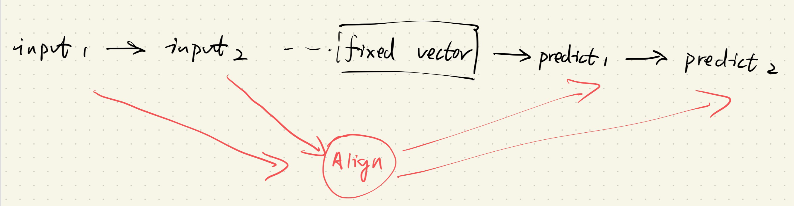
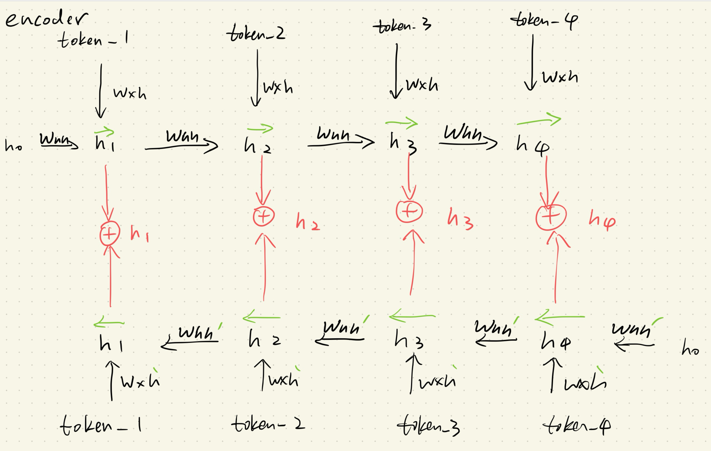
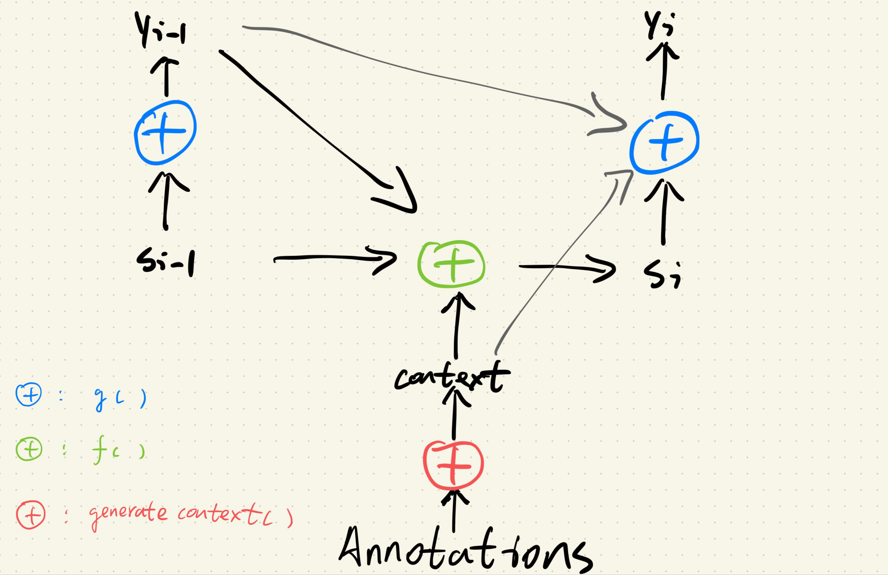

Orginal Paper:  [NEURAL MACHINE TRANSLATION BY JOINTLY LEARNING TO ALIGN AND TRANSLATE](https://arxiv.org/pdf/1409.0473)

在此访问[源代码](https://github.com/zhengyang-2002/Paper_reading-Replicating/blob/main/Code/Seq2seq.ipynb)


### 1. 引言

Seq2seq的出现为NMT(Neural Machine Translation)提供了一个完美的，端到端训练的范本，但是同时也存在了很多不成熟的地方有待改进。本文中就提到了传统Seq2seq模型存在的关键问题：

+ 传统的Seq2seq需要compress所有的输入信息到一个固定长度的向量，这大大限制了它在处理长序列任务时的性能。

基于这个问题，本文提出了一个关于新版Seq2seq模型的设想：

+ 这个新版的Seq2seq不仅可以利用一个固定长度的信息向量来解码，它还能进行软路由，即回顾输入的某个子集
+ “软路由”意味着模型需要根据上下文来自动选取合适的子集，并且这个子集可能是不明确的（模型需要想办法表征输入子集）
+ “回顾输入的某个子集”则意味着模型的信息通路需要进行调整（并非一条线到底的信息流）

基于以上设想，作者为这篇工作取名为Neural Machine Translation（点明任务类型）By Jointly Learning To Align And Translation（方法特点）。同时这篇工作中的方法还有一个响亮的名字，即Bahdanau Attention，也被认为是初代Attention机制。

### 2. 方法

简单来说，Bahdanau Attention在原有的Seq2seq基础之上额外设计了一条信息通路，类似：


即模型在完成传统的Seq2seq模型训练的同时，“jointly”训练“Align”模型。而这个Align模型通过选择性地回顾input，以解决fixed vector表达能力弱的问题。

#### 2.1 双向编码器

原文中采用了双向RNN模型以及他们的隐藏状态来表征所有input，类似：



具体来说，就是用两个相反的RNN网络来给每一个token都建立一个hidden_state，并且通过concatenate的方式将它们结合起来，得到所谓的annotation（这个annotation后续会通过align model来选择性地回放给decoder）。关于为什么要使用双向RNN而非普通的单向RNN，文中的解释是他们希望annotation不仅表征在它之前的word，还要表征在其之后的word。

我个人的理解是，如果使用单向RNN，那么位于序列开头的word总会得到更多的表征，这引入了不恰当的先验。同时双向RNN也更容易学习到全面的语序关系。

本文中Bi_Encoder的实现如下：

```python
class Bi_Encoder(nn.Module):
    def __init__(self):
        super(Bi_Encoder, self).__init__()
        def __create_xh(embedding_size, hidden_size):
            return nn.Sequential(
                nn.Linear(embedding_size, hidden_size//2),
                nn.ReLU(),
                nn.Linear(hidden_size//2, hidden_size)
            )
        def __create_hh(hidden_size):
            return nn.Sequential(
                nn.Linear(hidden_size, hidden_size//2),
                nn.ReLU(),
                nn.Linear(hidden_size//2, hidden_size)
            )
    
        self.xh = __create_xh(cfg.embedding_size, cfg.hidden_size)
        self.hh = __create_hh(cfg.hidden_size)
        self.xh_ = __create_xh(cfg.embedding_size, cfg.hidden_size)
        self.hh_ = __create_hh(cfg.hidden_size)
        
        self.tanh = nn.Tanh()

    def forward(self, seq, input_lengths):
        batch_size, seq_len, embedding_size = seq.size()
        mask = torch.arange(seq_len, device=cfg.device).expand(batch_size, -1) < input_lengths.unsqueeze(1)
        
        hidden_state = torch.zeros(batch_size, cfg.hidden_size, device=cfg.device)
        hidden_state_ = torch.zeros(batch_size, cfg.hidden_size, device=cfg.device)

        forward_hidden_states = torch.zeros(batch_size, seq_len, cfg.hidden_size, device=cfg.device)
        backward_hidden_states = torch.zeros(batch_size, seq_len, cfg.hidden_size, device=cfg.device)

        for t in range(seq_len):
            token, token_ = seq[:,t,:], seq[:,seq_len-t-1,:]
            current_mask, current_mask_ = mask[:, t].unsqueeze(1), mask[:, seq_len-t-1].unsqueeze(1)
            
            temp_hidden_state = self.tanh(self.xh(token)+self.hh(hidden_state))
            temp_hidden_state_ = self.tanh(self.xh_(token_)+self.hh_(hidden_state_))
            
            hidden_state = torch.where(current_mask, temp_hidden_state, hidden_state) # batch_size, embedding_size
            hidden_state_ = torch.where(current_mask_, temp_hidden_state_, hidden_state_)

            forward_hidden_states[:, t, :] = hidden_state
            backward_hidden_states[:, seq_len-t-1, :] = hidden_state_

        annotations = torch.concatenate([forward_hidden_states, backward_hidden_states], dim=-1)
        return hidden_state, annotations
```

实现方法上相较于单向RNN Encoder，只需要重新初始化一份相同的RNN网络，并且把token以逆序进行输入即可。同时逆向RNN并不需要重新定义Mask，直接采用Seq2seq文中提到的Mask的构建方法即可。当然在Bi_Encoder中，我们有两倍的参数需要维护，同时我们还需要额外保存所有的Annotations，这也给模型训练额外添加了成本。

总的来说，Bi_Encoder接收输入token，并且得到每个token的annotation，同时还返回正向RNN的最终hidden_state用以放入Decoder。

#### 2.2 注意力解码器

解码器的主要结构如下，大致包含了三个可训练的模块，在图中由蓝绿红三色来表示。

原文中关于这三个可训练模块的描述是：

\( p(y_i \mid y_1, \ldots, y_{i-1}, \mathbf{x}) = g(y_{i-1}, s_i, c_i) \)

\( s_i = f(s_{i-1}, y_{i-1}, c_i) \)

\[
c_i = \sum_{j=1}^{T_x} \alpha_{ij} h_j
\]

The weight \(\alpha_{ij}\) of each annotation \(h_j\) is computed by

\[
\alpha_{ij} = \frac{\exp(e_{ij})}{\sum_{k=1}^{T_x} \exp(e_{ik})}
\]

where

\[
e_{ij} = a(s_{i-1}, h_j)
\]





